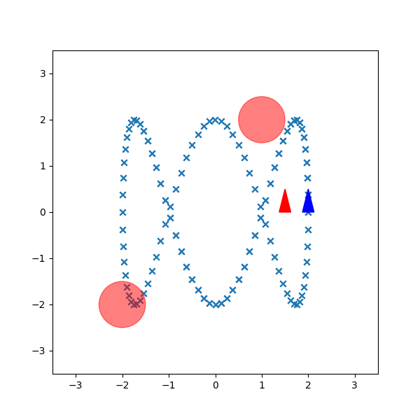

# Trajectory Tracking with Stochastic Optimal Control


## Requirements
To install requirements:
```
pip install -r requirements.txt
```

## Trajectory Tracking
To run trajectory tracking, use
```
python main_cec.py
```

## Table of Content
### main_cec.py
This file contains the main function that runs trajectory tacking algorithm.

### controller.py
This file contains implementation for a single P controls and also a LQR controller. The optimal controls is solved via non-linear programming.

### dynamics.py
This file contains implementation for error dynamics.

## Technical Details
See full technical details [here](images_display/report_github.pdf).

## References
1. CASADI non-linear programming
- https://web.casadi.org/docs/#nonlinear-programminga 
- https://www.philipzucker.com/casadi-pretty-damn-slick/